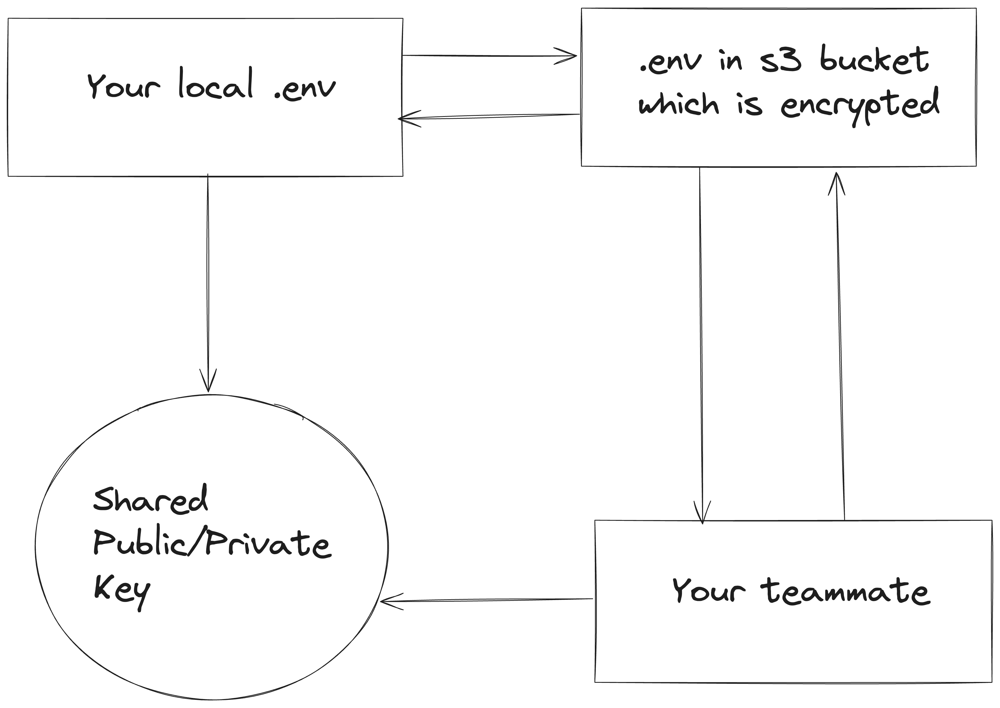

# envsync

Sync your environment files securely with public/private key encryption via AWS S3.

## Overview

`envsync` is a CLI tool designed to securely synchronize your `.env` files across different machines. It uses public/private key encryption for security and AWS S3 for storage.



## Commands

- `init`: Initialize your `envsync`. This command sets up public/private keys and configures AWS S3.
- `push`: Push your `.env` file from the current directory to the S3 bucket.
- `pull`: Pull your `.env` file from the S3 bucket to the current directory.

## Getting Started

### Prerequisites

1. **S3 Bucket**: Set up an S3 bucket, e.g., `your-s3-bucket`.
2. **IAM User**: Create an IAM user in AWS and attach the following policy for necessary permissions:

   ```json
   {
       "Version": "2012-10-17",
       "Statement": [
           {
               "Sid": "VisualEditor0",
               "Effect": "Allow",
               "Action": [
                   "s3:PutObject",
                   "s3:PutObjectAcl",
                   "s3:GetObject"
               ],
               "Resource": "arn:aws:s3:::your-s3-bucket/*"
           }
       ]
   }
   ```

3. **AWS Credentials**: Note down the IAM user’s `access_key_id` and `secret_access_key`.

### Initialization

Run `envsync init` and input the AWS configuration when prompted. This will set up the necessary keys and configuration for `envsync`.

### Usage

- **Pushing `.env` File**:

  To push the `.env` file from your current directory to S3, run:

  ```sh
  envsync push --name=yourprojectname
  ```

  This command encrypts your `.env` file and stores it at `your-s3-bucket/yourprojectname/.env` in S3.

- **Pulling `.env` File**:

  To pull the `.env` file from S3, run:

  ```sh
  envsync pull --name=yourprojectname
  ```

### Collaborating with Team Members

For team collaboration, follow these steps:

1. **IAM Permissions**: Ensure team members have the necessary IAM permissions (refer to the policy mentioned above).
2. **Key Sharing**: Share the public and private keys located in `$HOME/.envsync/` with your team.
3. **Team Setup**: Team members should run `envsync init` and configure their environment. They have two options:

   - **Using Shared Keys**: Replace their `private_key.pem` and `public_key.pem` files with the shared keys and simply run:

     ```sh
     envsync pull --name=yourprojectname
     ```

   - **Using a Configuration File**: Create their own configuration file and run:

     ```yaml
     aws:
       region: ap-southeast-1
       s3_bucket: your-s3-bucket
       access_key_id: your-aws-access-key
       secret_access_key: your-aws-secret-key
     envsync:
       private_key: ~/.envsync/private_key.pem
       public_key: ~/.envsync/public_key.pem
     ```

     ```sh
     envsync pull --name=yourprojectname --config=yourconfig.yaml
     ```